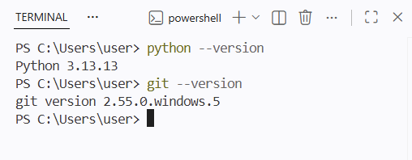
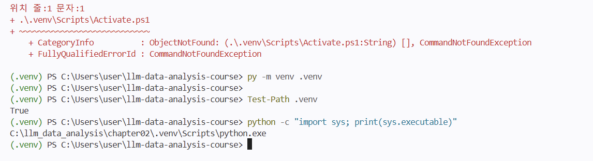

# Chapter 02 제출 답안. VS Code에서 시작하는 데이터 분석 환경

> 최종 파일은 개인 GitHub 저장소의 `chapter02/chapter02.md`로 저장하는 것을 권장합니다.

## 0. 제출 정보

- 이름: 김의현
- GitHub ID: ehyun125
- 개인 저장소: `llm-data-analysis-study`
- 작성일: 26.09.15
- 운영체제: Windows

### 최종 제출 URL

```text
https://github.com/ehyun125/llm-data-analysis-study/blob/main/chapter02/chapter02.md
```

---

## 1. Python과 Git 환경 확인

### 실행 내용

```text
python --version 또는 py --version
git --version
```

### 실행 결과

```
PS C:\Users\user> python --version
Python 3.13.13
PS C:\Users\user> git --version
git version 2.55.0.windows.5
```

### Evidence




### 결과 관찰

버전과 실행 가능 여부를 사실 위주로 작성하세요.
Python은3.13.13 버전/ GIT은 2.55.0 버전으로 작동됩니다. 
Python은 업데이트 전에 원활한 동작이 되지 않아 한번의 업데이트를 진행하였습니다.

### 나의 해석과 판단

데이터 분석 등 실행하는 데에 이상이 없다고 판단되어 실습에 적합하다고 생각합니다.

### 업무·분석적 의미
버전 불일치나 가상환경 미적용 시 라이브러리 충돌로 인해 제대로 동작하지 않을 수 있습니다.

### 한계와 추가 확인 사항

Python 기본 환경만 확인된 상태이므로, 실습 프로젝트에서 요구하는 필수 데이터 분석 라이브러리(pandas, numpy, matplotlib 등)의 설치 여부 및 버전 compatibility(호환성) 추가 확인이 필요합니다.

---

## 2. 저장소와 `.venv` 준비

### 수행 내용

- [o] 공식 Public 저장소 clone
- [o] 프로젝트 루트 확인
- [o] `.venv` 생성
- [o] `.venv` 활성화
- [o] `requirements.txt` 설치

### 핵심 실행 결과

```text
현재 프로젝트 경로: PS C:\Users\user\llm-data-analysis-course
터미널 Python 실행 파일: C:\llm_data_analysis\chapter02\.venv\Scripts\python.exe
가상환경 활성화 여부: O (venv 원활히 시행됨)
패키지 설치 결과: 성공 (requirements.txt의 주요 패키지 정상 설치 완료)
```

### Evidence




### 결과 관찰

현재 `python`이 어떤 실행 파일을 가리키는지 작성하세요.
python -c "import sys; print(sys.executable)"
C:\llm_data_analysis\chapter02\.venv\Scripts\python.exe
### 나의 해석과 판단

시스템 Python과 프로젝트 `.venv`를 분리하는 것이 왜 필요한지 자신의 말로 작성하세요.
: 시스템 Python의 경우 각 사용자가 다른 버전의 라이브러리를 활용할 가능성이 높고 이렇게 되면 실습하면서 발생했던 것 처럼 버전 업데이트가 되지 않아 작동 안할 확률이 높은데 이를 방지할 수 있습니다.
: 또한 각 사용자가 사용하는 OS가 다른데 이에 대한 부분도 보완 가능합니다.

### 업무·분석적 의미

다른 사람이 같은 프로젝트를 재실행할 때 가상환경이 주는 이점을 작성하세요.
: 팀원 모두가 라이브러리에 대하여 동일한 버전의 패키지를 설치하지 못하는 조건이 있기에 가상환경과 requirements.txt를 활용하면 팀원 모두가 동일한 패키지 버전을 설치하여 실행할 수 있습니다.
: 프로젝트간 패키지 충돌을 방지합니다.

### 한계와 추가 확인 사항

회사/기관 PC 정책, Python 버전 차이 등 현재 환경의 제약을 작성하세요.
: 기존에 활용했던 Python의 경우 업데이트가 안되어있어, 업데이트 후에나 작동이 원활히 됨을 확인할 수 있었습니다. 

---

## 3. VS Code 인터프리터와 Jupyter 커널 연결

### 확인 결과

```text
VS Code Python 인터프리터: C:\llm_data_analysis\chapter02\.venv\Scripts\python.exe
Notebook sys.executable:
Notebook Path.cwd():
```

### Evidence


### 결과 관찰

터미널 Python과 Notebook Python이 같은 `.venv`인지 작성하세요.
: 터미널과 Notebook에서 사용하는 Python 실행 파일이 모두 프로젝트의 .venv를
가리킨다고 생각하였고, 따라서 터미널과 Notebook은 같은 가상환경을 사용한다고 판단하였습니다.

### 나의 해석과 판단

둘이 다를 경우 어떤 문제가 발생할 수 있는지 작성하세요.
: 터미널과 Notebook의 Python 환경이 다를 경우 한쪽에만 설치된 라이브러리를 다른 쪽에서
찾지 못해 ModuleNotFoundError가 발생할 수 있습니다. 또한 같은 코드라도 패키지 버전
차이로 실행 결과가 달라질 수 있다는걸 확인했습니다.

### 업무·분석적 의미

`ModuleNotFoundError` 같은 환경 오류를 줄이는 데 어떤 도움이 되는지 작성하세요.
: VS Code 인터프리터와 Jupyter 커널을 같은 .venv로 연결하면 팀원 간 실행 환경 차이를
줄일 수 있고, 라이브러리 미설치나 버전 불일치로 인한 오류를 예방할 수 있습니다.

### 한계와 추가 확인 사항
: 커널 이름에 .venv가 표시되더라도 실제 연결 경로가 달라 파일 디렉토리 찾는데에 많은 어려움이 있었습니다. 이를 통해 중간에 Python 실행파일 경로를 확인해야한다고 깨달았습니다.

커널 이름만 보고 판단하면 안 되는 이유 등 추가 확인 사항을 작성하세요.
---

: 실제 연결 경로가 달라 원하는 파일이 아닌 다른 파일에 작업을 진행하게 되었습니다. 같은 venv 파일이라고 동일한 파일이 아님을 다시 한번 확인할 수 있었습니다.

## 4. 샘플 데이터와 Notebook 실행 검증

### 확인 결과

```text
DATA_DIR 존재 여부: True
customers.csv 존재 여부: True 
customers.shape: (150,6)
주요 컬럼: 'customer_id', 'name', 'gender', 'age', 'city', 'signup_date'
```

### Evidence


### 결과 관찰

`customers.head()`, shape, 컬럼 결과에서 직접 확인한 사실을 작성하세요.
: customer 데이터는 150행, 6개 컬럼으로 구성되었고 확인된 컬럼은  'customer_id', 'name', 'gender', 'age', 'city', 'signup_date'입니다.
### 나의 해석과 판단

이 단계까지 성공했다면 어떤 구성 요소가 정상 연결되었다고 판단할 수 있는지 작성하세요.
: 중간에 파일 디렉토리 찾는 과정에서 많이 헤맸지만 결국 원하는 결과를 도출 할 수 있었습니다.

### 업무·분석적 의미

분석 전에 최소 스모크 테스트를 하는 이유를 작성하세요.
: 
### 한계와 추가 확인 사항

현재는 환경 연결만 확인했으며 데이터 품질은 아직 검증하지 않았다는 점을 작성하세요.

---

## 5. 오류 해결 기록

실습 중 오류가 있었다면 작성합니다. 오류가 없었다면 `해당 없음`이라고 적습니다.

### 오류 메시지

```text
FileNotFoundError:
C:\llm_data_analysis\chapter02\data\raw\customers.csv 파일이 없습니다.
프로젝트 루트에서 python scripts/generate_sample_data.py를 실행하세요.
```

### 원인 후보
1. Chapter 02의 data/raw/customers.csv 파일이 생성되지 않았음
2. Notebook이 찾는 데이터 경로와 실제 데이터 저장 경로가 다름
3. 샘플 데이터 생성 스크립트가 정상 실행되지 않았거나 실행 위치가 달랐음


### 내가 확인한 순서

1. 오류 메시지에 표기된 파일 경로를 확인하였습니다.
2. customers.csv가 해당 경로에 존재하는지 확인하였습니다.
3. Jupyter 커널이 정상 실행되는지 확인하였습니다.

### 해결 방법

```text
실제로 적용한 해결 방법
: 결국 파일을 찾지 못해 chapter 1에서 customer.csv 파일을 통해 확인하였습니다.

```

### Evidence


### 나의 해석과 판단

왜 해당 원인이 가장 가능성이 높다고 판단했는지 작성하세요.
: 디렉토리 내 파일이 경로에 존재하지 않다고 판단하였습니다. llm-data-analysis-course라는 파일에 파일이 존재한다고 하였는데 실제로 pc엔 동일한 파일이 없었습니다.

### 한계와 추가 확인 사항

보안 정책 변경, 무분별한 삭제처럼 시도하지 않은 조치와 이유를 작성하세요.

---

## 6. Secret 보호 확인

- [o] `.env`는 Git 추적 대상이 아닙니다.
- [o] 실제 API Key를 코드에 작성하지 않았습니다.
- [o] 캡처 화면에 Token/비밀번호가 없습니다.
- [o] `.venv`를 Git에 올리지 않습니다.

### Evidence

필요한 경우 `git status`, `.gitignore` 확인 화면을 첨부합니다.


### 나의 해석과 판단

환경 파일과 비밀정보를 분리해야 하는 이유를 작성하세요.
---
개인정보 포함 될 경우 보안에 문제 생길 수 있어서 분리해야합니다.... 

## 7. Chapter 02 최종 회고

### 가장 중요했다고 생각한 환경 설정 1가지

```
VS Code 인터프리터와 Jupyter 커널을 프로젝트 `.venv`로 통일하는 설정
```

### 그 이유

```
터미널에서는 실행되지만 Notebook에서는 라이브러리를 찾지 못하는 환경 오류를 줄일 수 있고
실제로 Python 실행 경로와 커널 연결 상태를 확인하는 과정이 데이터 분석 실행 전에 중요하다는 점을 알게 되었습니다.
```

### 다음 Chapter에서 재사용할 환경 체크 3가지

1. 디렉토리 파일
2. 
3.

### 현재 환경의 한계 또는 주의점

```text
작성하세요.
```

---

## 최종 제출 체크

- [O] 핵심 Evidence 4~7장을 첨부했습니다.
- [O] 단순 캡처가 아니라 관찰과 판단을 작성했습니다.
- [0] Secret/개인정보가 없습니다.
- [0] GitHub에서 이미지가 정상 표시됩니다.
- [ ] 개인 저장소에 `chapter02/chapter02.md`를 업로드했습니다.
- [ ] 저장소 URL이 아니라 최종 파일 URL을 제출합니다.
