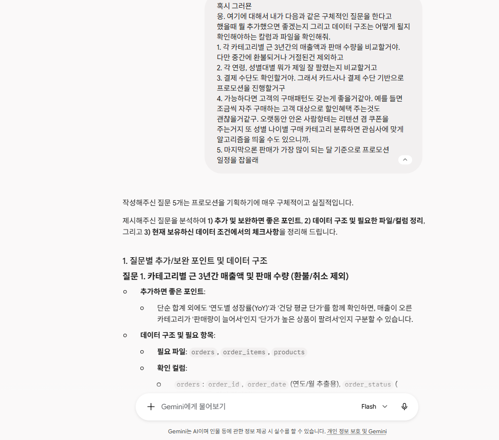
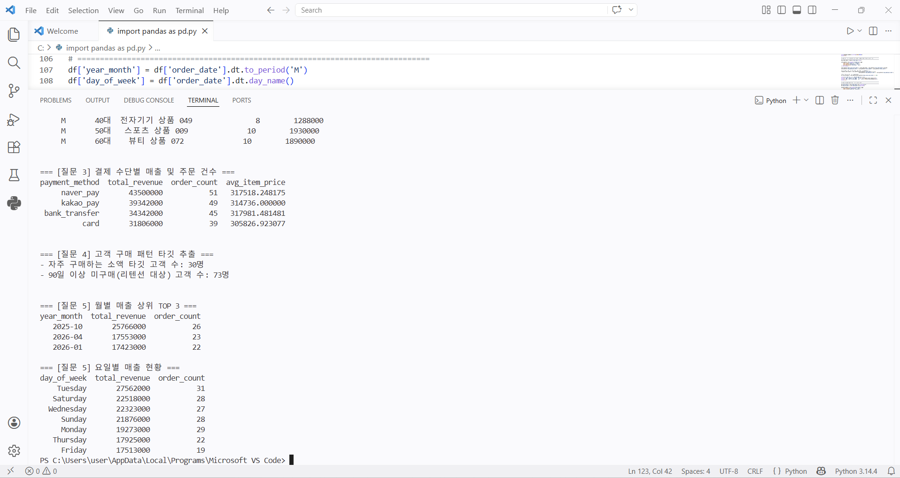
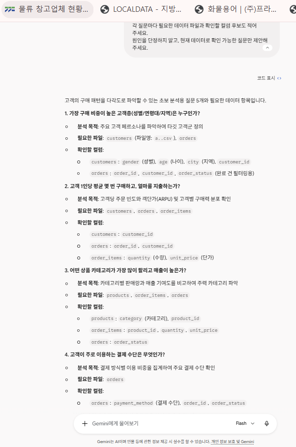
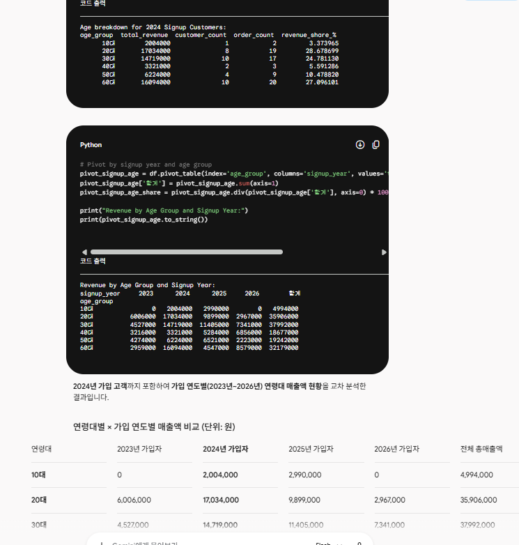
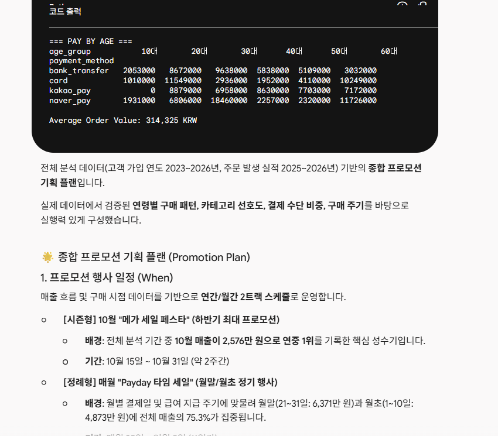
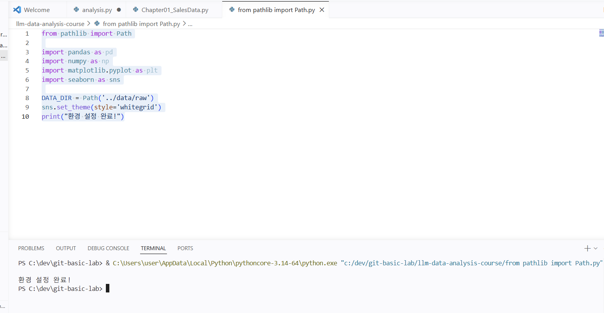

# Chapter 01 제출 답안. AI와 함께하는 데이터 분석의 시작

> 이 파일은 Chapter 01 실습 결과를 정리하여 제출하기 위한 학생용 템플릿입니다.  
> 강사 저장소의 원본 템플릿을 직접 수정하지 말고, 자신의 PC에 복사한 뒤 작성합니다.

---

## 0. 제출 정보

- 이름: 김의현
- GitHub ID: ehyun125
- 개인 저장소명: `llm-data-analysis-study`
- 작성일: 26.09.09
- 사용한 LLM: Gemini

### 최종 제출 URL

``` (https://github.com/ehyun125/llm-data-analysis-course/edit/main/chapter01/chapter01.md)
```

## 1. 원래 업무 질문

### 내가 선택한 막연한 질문

```
프로모션 행사를 기획하고자 하는데 어떻게 해야 효과적일까요?
```

### 왜 이 질문이 모호하다고 생각했는가?
목적은 분명하나 타겟 데이터가 불분명하다.
- 대상: completed 주문 기준 금액
- 기간: 지난 3년간 데이터 (24년도, 25년도, 26년도)
- 기준: 월별
- 비교 방법: 각 항목별 비교 분석
- 분석 목적: 언제 누굴 대상으로 어떤 카테고리 기준으로 프로모션을 진행해야 효율적일지에 대해 확인
  -> 프로모션 일정 세팅


### 분석 가능한 질문으로 다시 작성
1. 각 카테고리별 근 3년간의 매출액과 판매 수량을 비교 (completed 주문 기준)
2. 주요 카테고리별 메인 고객층의 연령대와 성별 어떻게 되는가?
3. 고객의 구매패턴 확인 필요 (조금씩 자주 구매하는지? 오랜만에 복귀하는지)
4. 판매량이 가장 많은 달 확인
5. 고객의 결제 수단 확인 

### 결과 관찰
기간
주문 상태 범위
집계 단위
비교 기준 (카테고리, 판매량, 성별, 연령대 등)
분석 목적 

### 나의 해석과 판단
타겟 대상에 대해서 명료화하였고, 데이터 컬럼들을 최대한 활용할 수 있는 기준으로 선정하였다. 
또한 근 3년에 대한 데이터 기반으로 분석을 진행하며 데이터에 대한 신뢰도를 쌓았고,
실제 운영 현황 및 비즈니스 측면을 기반으로 어떻게 더 구체화하고 효율화할 수 있을지를 고민하였다. 

### 업무·분석적 의미
블랙프라이데이, 시즌 세일 등 각 온라인 쇼핑몰에서는 프로모션 등을 진행하게 된다.
해당 데이터 기반으로 어떻게 해야 프로모션 기간에 고객을 더 많이 유입하고 판매량을 늘릴 수 있을지 고민했다. 

### 한계와 추가 확인 사항
다만, 지난 데이터 기반으로 타겟을 세팅한다고 해서 실제 운영 시 그대로 진행될 확률은 낮다.
이에 대하여 경쟁사 프로모션 기간과 겹치지는 않는지, 판매 물건들에 대한 공급망이 안전한지(안전 재고 등) 외부적 변수에 대한 고려가 필요하다.

### Evidence



---

## 2. 질문과 필요한 데이터 연결

### 필요한 데이터 파일

- [O] `customers.csv`
- [O] `products.csv`
- [O] `orders.csv`
- [O] `order_items.csv`

### 필요한 컬럼 후보

| 파일 | 필요한 컬럼 | 필요한 이유 |

--- products
|products.csv |product_name| 어떤 제품이 인기 많은지/ 실제로 카테고리 위주로 프로모션을 진행한다면 큰 의미 X, 아님 핵심 판매 주력 상품 세팅을 위해 필요할 수도 있을 것 같다. |
|products.csv |category| 어떤 카테고리 상품이 많이 나가는지 확인 |
|products.csv |price| 그 카테고리 상품 자체의 금액이 비싼지, 아님 정말 많이 팔리는건지 확인 필요 |

--- orders
|orders.csv|order_status|completed 상품 기준으로 데이터 확인|
|orders.csv|payment_method|향후 프로모션 진행시 카드사 할인등 사전 제휴 필요|
|orders.csv|order_date|어느 시점에가장 많이 팔리는지|

--- customers
|customers.csv|customer_id| 누가 어떤 상품을 구매했는지 맵핑|
|customers.csv|gender| 어떤 성별이 어떤 카테고리를 많이 구매했는지 맵핑|
|customers.csv|age| 각 연령대별 어떤 카테고리의 상품을 구매하는지 맵핑|

--- order_items
|order_items.csv|order_id| 누가 구매했는지 확인 필요|
|order_items.csv|product_id| 어떤 카테고리의 제품 구매했는지 확인|
|order_items.csv|order_id| 어떤 카테고리 상품이 제일 많이 팔리는지 확인 |
|order_items.csv|unit_price| 단가가 높아서 매출액이 높은건지, 아니면 실제로 수량이 많이 팔리는지 확인 |

### 데이터 연결 관계

```text
1. 각 카테고리별 근 3년간의 매출액과 판매 수량을 비교 (completed 주문 기준)
​- 데이터 구조 및 필요 항목:
​- 필요 파일: orders, order_items, products
​- 확인 컬럼:
​orders: order_id, order_date (연도/월 추출용), order_status (completed 건만 필터링)
​order_items: order_id, product_id, quantity, unit_price (매출액 = quantity × unit_price)
​products: product_id, category

2. 주요 카테고리별 메인 고객층의 연령대와 성별 어떻게 되는가?
​- 데이터 구조 및 필요 항목:
​- 필요 파일: customers, orders, order_items, products
​- 확인 컬럼:
​customers: customer_id, gender, age
​orders: order_id, customer_id, order_status (completed 기준)
​order_items: order_id, product_id, quantity
​products: product_id, product_name, category

3. 고객의 구매패턴 확인 필요 (조금씩 자주 구매하는지? 오랜만에 복귀하는지)
​- 데이터 구조 및 필요 항목:
​- 필요 파일: customers, orders, order_items, products
​- 확인 컬럼:
​customers: customer_id, gender, age
​orders: customer_id, order_id, order_date, order_status
​order_items: order_id, product_id, quantity, unit_price
​products: product_id, category

4. 판매량이 가장 많은 달 확인
​- 데이터 구조 및 필요 항목:
​- 필요 파일: customers, orders, order_items, products
​- 확인 컬럼:
​customers: customer_id, gender, age
​orders: customer_id, order_id, order_date, order_status
​order_items: order_id, product_id, quantity, unit_price
​products: product_id, category

5. 고객의 결제 수단 확인 
​- 데이터 구조 및 필요 항목:
​- 필요 파일: orders, order_items
​- 확인 컬럼:
​orders: order_id, payment_method (카드, 네이버페이, 카카오페이 등), order_status
​order_items: order_id, quantity, unit_price
```

### 결과 관찰

데이터들이 1개의 파일에 다 있는 것이 아니라 4개 파일로 혼재되어있어 데이터간 맵핑 과정이 필요하였습니다.

### 나의 해석과 판단

해당 데이터만으로 충분한 데이터 분석이 가능하였습니다. 

### 업무·분석적 의미

질문에 대한 적절한 데이터 선정이 데이터 분석 결과와 의사 결정의 방향성을 잡아주기 때문에 중요하다고 생각하였습니다.

### 한계와 추가 확인 사항

없습니다.

### Evidence

필요한 경우 관계도 또는 데이터 파일 확인 화면을 첨부하세요.



---

## 3. LLM에게 분석 질문 후보 요청

### 사용 목적

```
저의 생각에 대한 검증과 방향성에 대해 확인하고자 질의하였고, 제대로 분석하고 있는지 싶어 질의하였습니다.
실제로 방향성이 맞았고 일부 누락되거나 새롭게 알게된 사실도 있어 확인할 수 있는 계기가 되었습니다.
```

### 사용한 Prompt

```
온라인 쇼핑몰 데이터 분석을 준비하고 있습니다.

데이터는 다음 4개 파일로 구성됩니다.
- customers: 고객 정보
- products: 상품 정보
- orders: 주문 정보
- order_items: 주문 상세 정보

목적은 고객의 구매 패턴을 이해하여 가장 적절한 프로모션을 기획하는 것입니다.

초보 데이터 분석자가 먼저 확인할 분석 질문 5개를 제안해 주세요.
각 질문마다 필요한 데이터 파일과 확인할 컬럼 후보도 적어 주세요.
원인을 단정하지 말고, 현재 데이터로 확인 가능한 질문만 제안해 주세요.
```

### LLM 답변 요약

LLM의 전체 답변을 그대로 복사하지 말고 핵심 제안 3~5개를 요약하세요.

1. 월별 / 요일별 / 일별 주문량이 가장 집중되는 시점은 언제인가?
   - ​목적: 프로모션 오픈 날짜와 진행 기간(주말 vs 평일, 월말 vs 월초)을 설정하기 위함
2. 가입 후 첫 구매까지 걸리는 기간과 첫 구매 이후 재구매 주기(간격)는 며칠인가?
   - ​목적: 신규 고객 리타겟팅 쿠폰 지급 시점 및 기존 고객 대상 재구매 유도 프로모션 주기 결정
​3. 함께 자주 구매되는 상품 조합(장바구니 조합)은 무엇인가?
   - ​목적: 번들 할인(묶음 상품), 연관 상품 추천 및 Cross-selling 프로모션 기획
4. 주요 고객 타깃층(성별/연령대)별로 주로 구매하는 상품 카테고리는 어떻게 다른가?
   - ​목적: 타깃 고객군별 맞춤형 기획전 구성 및 전용 할인 쿠폰 설계
5. ​평균 주문 금액(객단가) 구간과 결제 수단별 비중은 어떠한가?
   - ​목적: "OO원 이상 구매 시 무료배송/할인" 조건 설정 및 결제 수단 제휴(네이버페이/카카오페이 등) 프로모션 기획

### 결과 관찰
- 대체로 질문에 대한 방향성은 비슷하였습니다. 

### 나의 해석과 판단
- 판매 방법인 크로스셀링이나 진행 기간에 대한 부분은 좀 더 디테일하게 고찰할 수 있는 계기가 되었습니다.

### 업무·분석적 의미
- 현업이 아닌 이상 생각하기 어려운 부분도 분명히 있음을 확인하였습니다.

### 한계와 추가 확인 사항
- 실제 데이터 분석결과와 비교하였으나 결과와 동일함을 확인하였습니다.

### Evidence



---

## 4. LLM 제안 검증

LLM 제안 중 하나 이상을 선택해 검토합니다.

| 검증 항목 | 확인 내용 |
| --- | --- |
| 선택한 LLM 제안 |  |
| 필요한 파일 |  |
| 필요한 컬럼 |  |
| 계산 범위 |  |
| 실제 데이터 확인 필요 여부 |  |
| 원인 단정 여부 |  |
| 최종 판단 | 사용 / 수정 후 사용 / 보류 |

### 내가 수정한 내용

```text
LLM 제안을 수정했다면 무엇을 어떻게 바꿨는지 작성하세요.
```

### 결과 관찰

검증 과정에서 확인된 사실을 작성하세요.

### 나의 해석과 판단

왜 `사용 / 수정 후 사용 / 보류` 중 해당 결정을 내렸는지 작성하세요.

### 업무·분석적 의미

LLM 제안을 검증하지 않고 바로 사용하는 경우 어떤 문제가 생길 수 있는지 작성하세요.

### 한계와 추가 확인 사항

아직 실제 데이터로 검증하지 못한 부분을 명확히 작성하세요.

### Evidence



---

## 5. Prompt Log

- 사용 목적:
- 입력 Prompt 요약:
- LLM 답변 요약:
- 실제 반영 여부:
- 사람이 검증한 항목:
- 사람이 수정한 내용:
- 남은 확인 사항:

### 결과 관찰

LLM 사용 기록에서 어떤 의사결정 과정을 확인할 수 있는지 작성하세요.

### 나의 해석과 판단

Prompt Log를 남기는 것이 왜 필요한지 자신의 말로 작성하세요.

### Evidence



---

## 6. 개인정보와 Secret 보호 확인

다음 항목을 확인합니다.

- [O] 실제 이름·이메일·전화번호 등 고객 개인정보를 Prompt에 사용하지 않았습니다.
- [O] API Key를 코드나 Notebook에 직접 작성하지 않았습니다.
- [O] `.env` 실제 내용을 캡처하거나 업로드하지 않았습니다.
- [O] GitHub Token, 비밀번호, 내부 URL이 캡처에 보이지 않습니다.
- [O] 제출 전 이미지까지 다시 확인했습니다.

### 나의 판단

이번 실습에서 어떤 정보는 LLM 또는 Public GitHub에 올리면 안 된다고 판단했는지 작성하세요.
--- 개인 정보에 대한 부분 (아무리 가상이라고 하더라도 이름에 대한 부분은 개인정보로 올리면 안된다고 생각하였습니다.)

## 7. Chapter 01 Notebook 확인

Notebook:

```text
notebooks/ch01_ai_data_analysis_intro.ipynb
```

### 내 환경 상태

- [ ] 아직 환경설정 전이라 Notebook 위치만 확인했습니다.
- [ ] 환경설정이 완료되어 Notebook을 직접 실행했습니다.

### 환경설정 완료 학생만 작성

#### 실행한 코드

```python
from pathlib import Path

import pandas as pd
import numpy as np
import matplotlib.pyplot as plt
import seaborn as sns

DATA_DIR = Path('../data/raw')
sns.set_theme(style='whitegrid')
```

#### 실행 결과

```text
오류 없이 실행되었는지 작성하세요.
```

#### 결과 관찰

실행 결과에서 확인한 사실을 작성하세요.

#### 나의 해석과 판단

현재 Notebook이 본격 분석이 아니라 starter scaffold라는 의미를 자신의 말로 설명하세요.

#### 한계와 추가 확인 사항

Chapter 02 또는 Chapter 03에서 추가로 확인해야 할 내용을 작성하세요.

#### Evidence



> 환경설정 전이라면 이 이미지는 생략할 수 있습니다.

---

## 8. Chapter 01 최종 해석

### 이번 장에서 가장 중요하다고 생각한 내용

```text
자신의 말로 3~5문장 작성하세요.
```

### LLM을 데이터 분석에 사용할 때 가장 조심해야 할 점

```text
자신의 판단을 작성하세요.
```

### 사람과 LLM의 역할 차이

| 항목 | LLM이 도울 수 있는 부분 | 사람이 책임져야 하는 부분 |
| --- | --- | --- |
| 질문 정의 |  |  |
| 데이터 확인 |  |  |
| 코드 작성 |  |  |
| 결과 해석 |  |  |
| 최종 판단 |  |  |

### 다음 Chapter에서 확인하고 싶은 것

```text
이번 장에서 남은 의문이나 Chapter 02~03에서 확인하고 싶은 내용을 작성하세요.
```

---

## 9. 최종 제출 체크리스트

- [O] 원래 업무 질문과 구체화한 분석 질문을 작성했습니다.
- [O] 질문에 필요한 데이터 파일과 컬럼 후보를 정리했습니다.
- [O] LLM Prompt와 답변 요약을 작성했습니다.
- [O] LLM 제안을 실제 데이터 관점에서 검증했습니다.
- [O] 각 핵심 STEP의 결과 관찰을 작성했습니다.
- [O] 각 핵심 STEP의 나의 해석과 판단을 작성했습니다.
- [O] 업무·분석적 의미를 작성했습니다.
- [O] 한계와 추가 확인 사항을 작성했습니다.
- [O] 핵심 실행 Evidence 이미지를 첨부했습니다.
- [-] 이미지가 Markdown에서 정상 표시됩니다.
- [O] 개인정보가 없습니다.
- [O] API Key·Secret·Token이 없습니다.
- [-] 개인 GitHub 저장소에 업로드했습니다.
- [-] GitHub에서 Markdown과 이미지가 정상 표시됩니다.
- [-] 아래 최종 파일 URL이 정상적으로 열립니다.

### 최종 파일 URL

```text
https://github.com/<내-GitHub-ID>/llm-data-analysis-study/blob/main/chapter01/chapter01.md
```

---

## 10. 교수자 확인용 요약

### 수행 상태

- [ ] COMPLETE
- [ ] PARTIAL

### 내가 가장 중요하게 내린 판단 1개

```text
여기에 작성하세요.
```

### 아직 확인이 필요한 내용 1개

```text
여기에 작성하세요.
```
